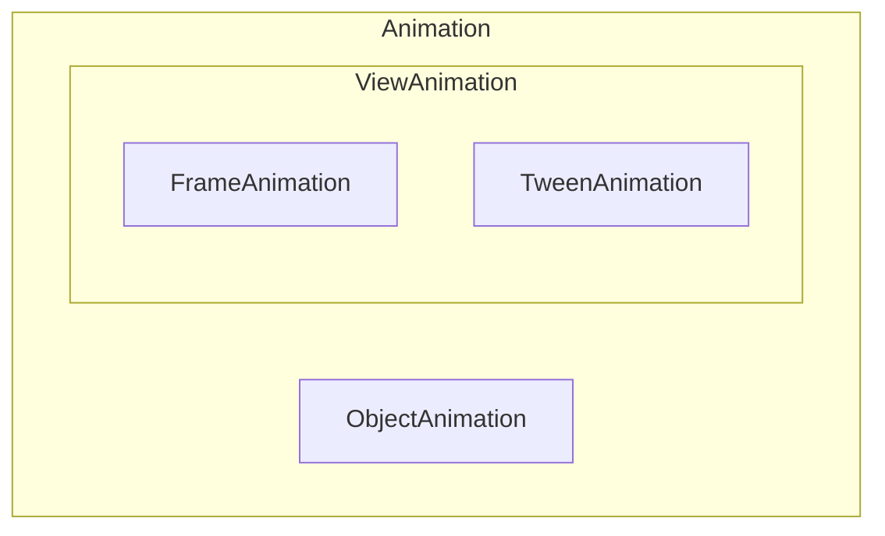

# 动画的分类




# 视图动画（View Animation）

## 补间动画（Tween Animation）

### 概述

- 作用于视图对象`View`，如`TextView`，不可作用于属性，如点击响应位置等
- 通过确定开始的视图样式 & 结束的视图样式、中间动画变化过程由系统补全来确定一个动画
- 动画可以在视图对象的内容上执行一系列简单的转换(位置、大小、旋转和透明度)。如果你有一个TextView对象，你可以移动，旋转，缩放文本。如果它有一个背景图像，背景图像将随着文本一起被转换。
- 由`XML`或`JAVA`代码定义。建议使用`XML`文件，因为它比更可读、可重用和可切换

### 分类

根据动画效果，补间动画分为以下**4类**：

- 透明度动画（alpha）
- 缩放动画（scale）
- 平移动画（Translate）
- 旋转动画（rotate）

不同动画与Java类、xml文件关键字对应关系如下：

|    名称    |      Java子类      |        xml关键字        |                             说明                             |
| :--------: | :----------------: | :---------------------: | :----------------------------------------------------------: |
| 透明度动画 |   AlphaAnimation   | 放置在`res/anim/`目录下 |                          透明度渐变                          |
|  旋转动画  |  RotateAnimation   | 放置在`res/anim/`目录下 |                           视图旋转                           |
|  缩放动画  |   ScaleAnimation   | 放置在`res/anim/`目录下 |                    放大/缩小 视图尺寸大小                    |
|  平移动画  | TranslateAnimation | 放置在`res/anim/`目录下 |                         视图位置移动                         |
|  复合动画  |    AnimationSet    | 放置在`res/anim/`目录下 | 一个持有其它动画元素alpha、scale、translate、rotate或者其它set元素的容器 |

### 详细说明

**补间动画的继承关系：**


由于`Animation`是抽象基类，其提供了一些通用的动画属性方法，如下所示

|         xml属性         |           Java方法            |                             说明                             |
| :---------------------: | :---------------------------: | :----------------------------------------------------------: |
| android:detachWallpaper |  setDetachWallpaper(boolean)  |                       是否在壁纸上运行                       |
|    android:duration     |       setDuration(long)       |          动画的运行时间(以毫秒为单位)；**必须设置**          |
|    android:fillAfter    |     setFillAfter(boolean)     | 动画结束时是否保持动画最后的状态；默认为false，优先于fillBefore |
|   android:fillBefore    |    setFillBefore(boolean)     |       动画结束时是否还原到开始动画前的状态；默认为true       |
|   android:fillEnabled   |    setFillEnabled(boolean)    |    是否应用fillBefore的值，对fillAfter无影响；默认为true     |
|  android:interpolator   | setInterpolator(Interpolator) |           设定插值器（指定的动画效果，譬如回弹等）           |
|   android:repeatCount   |      setRepeatCount(int)      |                           重复次数                           |
|   android:repeatMode    |      setRepeatMode(int)       |  重复类型有两个值，reverse表示倒序回放，restart表示从头播放  |
|   android:startOffset   |     setStartOffset(long)      |       调用start函数之后等待开始运行的时间，单位为毫秒        |
|   android:zAdjustment   |      setZAdjustment(int)      | 表示被设置动画的内容运行时在Z轴上的位置（top/bottom/normal），默认为normal |


##### 透明度动画（Alpha）-- 属性

|      xml属性      |              Java方法              |                          说明                          |
| :---------------: | :--------------------------------: | :----------------------------------------------------: |
| android:fromAlpha | AlphaAnimation(float fromAlpha, …) | 动画开始的透明度（0.0到1.0，0.0是全透明，1.0是不透明） |
|  android:toAlpha  |  AlphaAnimation(…, float toAlpha)  |                 动画结束的透明度，同上                 |


##### 旋转动画（Rotate）-- 属性

|       xml属性       |                Java方法                |                             说明                             |
| :-----------------: | :------------------------------------: | :----------------------------------------------------------: |
| android:fromDegrees | RotateAnimation(float fromDegrees, …)  |       旋转开始角度，正代表顺时针度数，负代表逆时针度数       |
|  android:toDegrees  | RotateAnimation(…, float toDegrees, …) |       旋转结束角度，正代表顺时针度数，负代表逆时针度数       |
|   android:pivotX    |  RotateAnimation(…, float pivotX, …)   | 缩放起点X坐标（数值、百分数、百分数p，譬如50表示以当前View左上角坐标加50px为初始点、50%表示以当前View的左上角加上当前View宽高的50%做为初始点、50%p表示以当前View的左上角加上父控件宽高的50%做为初始点） |
|   android:pivotY    |    RotateAnimation(…, float pivotY)    |                   缩放起点Y坐标，同上规律                    |


##### 缩放动画（Scale）-- 属性

|      xml属性       |              Java方法              |                             说明                             |
| :----------------: | :--------------------------------: | :----------------------------------------------------------: |
| android:fromXScale |   ScaleAnimation(float fromX, …)   |                初始X轴缩放比例，1.0表示无变化                |
|  android:toXScale  |  ScaleAnimation(…, float toX, …)   |                       结束X轴缩放比例                        |
| android:fromYScale | ScaleAnimation(…, float fromY, …)  |                       初始Y轴缩放比例                        |
|  android:toYScale  |  ScaleAnimation(…, float toY, …)   |                       结束Y轴缩放比例                        |
|   android:pivotX   | ScaleAnimation(…, float pivotX, …) | 缩放起点X轴坐标（数值、百分数、百分数p，譬如50表示以当前View左上角坐标加50px为初始点、50%表示以当前View的左上角加上当前View宽高的50%做为初始点、50%p表示以当前View的左上角加上父控件宽高的50%做为初始点） |
|   android:pivotY   |  ScaleAnimation(…, float pivotY)   |                  缩放起点Y轴坐标，同上规律                   |


##### 平移动画（Translate）-- 属性

|      xml属性       |                  Java方法                  |                             说明                             |
| :----------------: | :----------------------------------------: | :----------------------------------------------------------: |
| android:fromXDelta |  TranslateAnimation(float fromXDelta, …)   | 起始点X轴坐标（数值、百分数、百分数p，譬如50表示以当前View左上角坐标加50px为初始点、50%表示以当前View的左上角加上当前View宽高的50%做为初始点、50%p表示以当前View的左上角加上父控件宽高的50%做为初始点） |
| android:fromYDelta | TranslateAnimation(…, float fromYDelta, …) |                   起始点Y轴从标，同上规律                    |
|  android:toXDelta  |  TranslateAnimation(…, float toXDelta, …)  |                   结束点X轴坐标，同上规律                    |
|  android:toYDelta  |   TranslateAnimation(…, float toYDelta)    |                   结束点Y轴坐标，同上规律                    |


### 具体使用

#### XML方式

- 文件位置：
   `res/anim/filename.xml`
- 资源引用
   Java: `R.anim.filename`
   XML: `@[package:]anim/filename`
- 语法:


```xml
<?xml version="1.0" encoding="utf-8"?>
<set xmlns:android="http://schemas.android.com/apk/res/android"
    android:interpolator="@[package:]anim/interpolator_resource"
    android:shareInterpolator=["true" | "false"] >
    <alpha
        android:fromAlpha="float"
        android:toAlpha="float" />
    <scale
        android:fromXScale="float"
        android:toXScale="float"
        android:fromYScale="float"
        android:toYScale="float"
        android:pivotX="float"
        android:pivotY="float" />
    <translate
        android:fromXDelta="float"
        android:toXDelta="float"
        android:fromYDelta="float"
        android:toYDelta="float" />
    <rotate
        android:fromDegrees="float"
        android:toDegrees="float"
        android:pivotX="float"
        android:pivotY="float" />
    <set>
        ...
    </set>
</set>
```

- 创建动画


```kotlin
ImageView spaceshipImage = (ImageView) findViewById(R.id.spaceshipImage);
Animation myAnimation= AnimationUtils.loadAnimation(this, R.anim.filename);
spaceshipImage.startAnimation(myAnimation);
```

以上就是一个标准的**XML方式**使用自定义的补间动画的模板

#### JAVA方式

示例如下：


```cpp
ImageView imageView = findViewById(R.id.image_view);
        // 创建 需要设置动画的 视图View

        // 组合动画设置
        AnimationSet setAnimation = new AnimationSet(true);
        // 创建组合动画对象(设置为true)

        // 设置组合动画的属性
        setAnimation.setRepeatMode(Animation.RESTART);
        ...

        // 逐个创建子动画,不作过多描述

        // 子动画1:透明度动画
        Animation alpha = new AlphaAnimation(1,0);
        alpha.setDuration(3000);
        ...

        // 子动画2:缩放动画
        Animation scale1 = new ScaleAnimation(1,0.5f,1,0.5f,Animation.RELATIVE_TO_SELF,0.5f,Animation.RELATIVE_TO_SELF,0.5f);
        scale1.setDuration(1000);
        ...
        
        // 子动画3:平移动画
        Animation translate = new TranslateAnimation(TranslateAnimation.RELATIVE_TO_PARENT,-0.5f,
                TranslateAnimation.RELATIVE_TO_PARENT,0.5f,
                TranslateAnimation.RELATIVE_TO_SELF,0
                ,TranslateAnimation.RELATIVE_TO_SELF,0);
        translate.setDuration(10000);
        ...
        
        // 子动画4:旋转动画
        Animation rotate = new RotateAnimation(0,360,Animation.RELATIVE_TO_SELF,0.5f,Animation.RELATIVE_TO_SELF,0.5f);
        rotate.setDuration(1000);
        rotate.setRepeatMode(Animation.RESTART);
        rotate.setRepeatCount(Animation.INFINITE);
        ...
        

        // 将创建的子动画添加到组合动画里
        setAnimation.addAnimation(alpha);
        setAnimation.addAnimation(rotate);
        setAnimation.addAnimation(translate);
        setAnimation.addAnimation(scale1);

        imageView.startAnimation(setAnimation);
        // 播放动画
```

> **首选XML方式使用动画**（不意味着XML方式全面优于JAVA方式）
>
> - XML方式：可读性好
> - JAVA方式：可动态创建动画效果

至于补间动画的使用，`Animation`还有如下一些比较实用的方法介绍：

| Animation类的方法 |           解释            |
| :---------------: | :-----------------------: |
|      reset()      |   重置Animation的初始化   |
|     cancel()      |     取消Animation动画     |
|      start()      |     开始Animation动画     |
|   hasStarted()    | 判断当前Animation是否开始 |
|    hasEnded()     | 判断当前Animation是否结束 |

既然补间动画只能给`View`使用，那就来看看`View`中和动画相关的几个常用方法吧，如下：

|      View类的常用动画操作方法       |               解释                |
| :---------------------------------: | :-------------------------------: |
| startAnimation(Animation animation) | 对当前View开始设置的Animation动画 |
|          clearAnimation()           |  取消当View在执行的Animation动画  |

> 特别特别注意：补间动画执行之后并未改变View的真实布局属性值。切记这一点，譬如我们在Activity中有一个Button在屏幕上方，我们设置了平移动画移动到屏幕下方然后保持动画最后执行状态呆在屏幕下方，这时如果点击屏幕下方动画执行之后的Button是没有任何反应的，而点击原来屏幕上方没有Button的地方却响应的是点击Button的事件。

### 动画监听

- 动画监听器接收来自动画的通知。通知表示与动画相关的事件，例如动画的结束或重复
- 使用方法：


```java
Animation.addListener(new AnimatorListener() {
          @Override
          public void onAnimationStart(Animation animation) {
              //动画开始时执行
          }
      
           @Override
          public void onAnimationRepeat(Animation animation) {
              //动画重复时执行
          }

         @Override
          public void onAnimationCancel()(Animation animation) {
              //动画取消时执行
          }
    
          @Override
          public void onAnimationEnd(Animation animation) {
              //动画结束时执行
          }
      });
```

> - 补间动画的监听只能通过此方式，且必须要复写全部4个方法。
> - 属性动画时，可以采用`Animator.addListener(new AnimatorListenerAdapter(){ //复写指定方法 })`------动画适配器AnimatorListenerAdapter中已经实现好每个接口

### 插值器Interpolator

#### 简介

插值器是在XML中定义的一个动画修改器，它影响动画的变化率。这允许现有动画附加加速、减速、重复、反弹等效果。

#### 继承关系


系统为我们提供了上图中的各种插值器，其都是实现了Interpolator接口的实现类，具体说明如下：

|              java类              |                    XML 资源ID                    |                             说明                             |
| :------------------------------: | :----------------------------------------------: | :----------------------------------------------------------: |
| AccelerateDecelerateInterpolator | @android:anim/accelerate_decelerate_interpolator |                         先加速再减速                         |
|      AccelerateInterpolator      |      @android:anim/accelerate_interpolator       |                           持续加速                           |
|      AnticipateInterpolator      |      @android:anim/anticipate_interpolator       |                       先退后再加速前进                       |
| AnticipateOvershootInterpolator  | @android:anim/anticipate_overshoot_interpolator  |             先退后再加速前进，超出终点后再回终点             |
|        BounceInterpolator        |        @android:anim/bounce_interpolator         |                        结束时弹球效果                        |
|        CycleInterpolator         |         @android:anim/cycle_interpolator         |                           周期运动                           |
|      DecelerateInterpolator      |      @android:anim/decelerate_interpolator       |                             减速                             |
|        LinearInterpolator        |        @android:anim/linear_interpolator         |                             匀速                             |
|      OvershootInterpolator       |       @android:anim/overshoot_interpolator       | 向前弹出一定值之后回到原来位置(快速完成动画，超出再回到结束样式) |

#### 使用方法

- XML方式


```bash
<set android:interpolator="@android:anim/accelerate_interpolator">
    ...
</set>
```

- JAVA方式


```cpp
Animation alphaAnimation = new AlphaAnimation(1,0);
                alphaAnimation.setDuration(3000);
                //创建插值器对象
                Interpolator interpolator = new OvershootInterpolator();
                //为动画添加插值器
                alphaAnimation.setInterpolator(interpolator);
                imageView.startAnimation(alphaAnimation);
```

#### 自定义插值器

某些情景可能你会发现系统提供的插值器不能满足需求，此时我们需要自定义插值器。有两种实现方式：**XML自定义实现** 和 **JAVA代码实现方式**

##### XML实现

1. 在`res/anim/`下创建`filename.xml`
2. 修改插值器属性（如下不作任何修改，则与系统预设插值器功能相同）
3. 这里的InterpolatorName 指的是系统原有的差值器，可以对其进行修改

```xml
<?xml version="1.0" encoding="utf-8"?>
<InterpolatorName xmlns:android="http://schemas.android.com/apk/res/android"
    android:attribute_name="value"/>
```

1. 补间动画中引用该文件（资源引用为`@[package:]anim/filename`）

XML实现方式本质就是**修改系统提供的插值器的某些属性**，具体可修改属性如下：

|               插值器               |               可修改属性               |                           属性说明                           |
| :--------------------------------: | :------------------------------------: | :----------------------------------------------------------: |
| <accelerateDecelerateInterpolator> |                 无属性                 |                                                              |
|      <accelerateInterpolator>      |             android:factor             |                 Float，加速速率（默认值为1）                 |
|      <anticipateInterpolator>      |            android:tension             |            Float. 起始点后拉的张力数（默认值为2）            |
| <anticipateOvershootInterpolator>  | android:tension   android:extraTension | Float. 起始点后拉的张力数（默认值为2） Float. 拉力的倍数（默认值为1.5） |
|        <bounceInterpolator>        |                 无属性                 |                                                              |
|        <cycleInterpolator>         |             android:cycles             |                 Integer. 循环次数（默认为1）                 |
|      <decelerateInterpolator>      |             android:factor             |                 Float. 减速的速率（默认为1）                 |
|        <linearInterpolator>        |                 无属性                 |                                                              |
|      <overshootInterpolator>       |            android:tension             |              Float. 超出终点后的张力（默认为2）              |

##### JAVA方式

**在此只讨论原理，不设计具体逻辑**（奈何我是个数学渣，公式真的是一头雾水= =）

在前面继承关系的图中，我们可以看出所有插值器继承自`BaseInterpolator`，其又实现了`Interpolator`接口，而`Interpolator`接口继承自`TimeInterpolator`接口，`TimeInterpolator`接口中的唯一抽象方法为`getInterpolation(float input)`，这个方法是由系统调用的，其中的参数input代表动画的时间，在0和1之间，也就是开始和结束之间。

我们可以看一下系统提供的插值器，如`AccelerateDecelerateInterpolator`，其源码极其极其简单，如下：


```java
@HasNativeInterpolator
public class AccelerateDecelerateInterpolator extends BaseInterpolator
        implements NativeInterpolatorFactory {
    public AccelerateDecelerateInterpolator() {
    }

    @SuppressWarnings({"UnusedDeclaration"})
    public AccelerateDecelerateInterpolator(Context context, AttributeSet attrs) {
    }

    public float getInterpolation(float input) {
        return (float)(Math.cos((input + 1) * Math.PI) / 2.0f) + 0.5f;
    }

    /** @hide */
    @Override
    public long createNativeInterpolator() {
        return NativeInterpolatorFactoryHelper.createAccelerateDecelerateInterpolator();
    }
}
```

可以看到，核心方法就是前面提到的`getInterpolation()`，其效果就是通过这一数学公式得来的，好久不看数学，已经快看不懂这个公式结果是什么了，汗颜= =


```cpp
public float getInterpolation(float input) {
        return (float)(Math.cos((input + 1) * Math.PI) / 2.0f) + 0.5f;
    }
```

**由此我们总结以下JAVA方式自定义插值器：**

- 根据需求实现`TimeInterpolator`接口
- **实现抽象方法`getInterpolation()`**，在该方法中处理逻辑
- 为动画设置该 自定义插值器

------

## 帧动画（Frame Animation）

### 概述

- 作用于视图对象View，如`TextView`，不可作用于属性，如点击响应位置等
- 将动画拆分为帧的形式，且每一帧都是一张图片，本质就是按序播放一组预先定义好的图片
- 两种实现方式：`XML` & `JAVA`，依旧**推荐XML方式**(你问我为什么还是推荐`XML`？连Google API中都只介绍`XML`方式，还不能说明问题么)

### 继承关系


 我们很清楚的看到，其本质是Drawable，，因此帧动画的XML定义文件放在`res/drawable/`目录下


### 使用说明

#### XML方式

1. 在`res/drawable/`下创建`filename.xml`文件
2. 设置图片资源，示例如下：


```xml
<?xml version="1.0" encoding="utf-8"?>
<animation-list xmlns:android="http://schemas.android.com/apk/res/android"
    android:oneshot=["true" | "false"] >
    <item
        android:drawable="@[package:]drawable/drawable_resource_name"
        android:duration="integer" />
    //如下
    <item android:drawable="@drawable/wheel0" android:duration="50" />
    <item android:drawable="@drawable/wheel1" android:duration="50" />
    <item android:drawable="@drawable/wheel2" android:duration="50" />
    <item android:drawable="@drawable/wheel3" android:duration="50" />
    <item android:drawable="@drawable/wheel4" android:duration="50" />
    <item android:drawable="@drawable/wheel5" android:duration="50" />
</animation-list>
```

1. 启动动画


```undefined
ImageView rocketImage = (ImageView) findViewById(R.id.rocket_image);
rocketImage.setBackgroundResource(R.drawable.rocket_thrust);

rocketAnimation = (AnimationDrawable) rocketImage.getBackground();
rocketAnimation.start();
```

##### 参数说明

``：必须是根节点，包含一个或者多个``元素，包含属性如下：

- `android:oneshot`：`true`代表只执行一次，`false`循环执行。
- `` 类似一帧的动画资源。

`` ：`animation-list`的子项，包含属性如下：

- `android:drawable` 一帧的`Drawable`资源。
- `android:duration` 一帧显示多长时间。

#### JAVA方式


```java
<-- 直接从drawable文件夹获取动画资源（图片） -->
        animationDrawable = new AnimationDrawable();
        for (int i = 0; i <= 25; i++) {
            int id = getResources().getIdentifier("a" + i, "drawable", getPackageName());
            Drawable drawable = getResources().getDrawable(id);
            animationDrawable.addFrame(drawable, 100);
        }

        <-- 开始动画 -->
        btn_startFrame.setOnClickListener(new View.OnClickListener() {
            @Override
            public void onClick(View v) {
                animationDrawable.setOneShot(true);
                iv.setImageDrawable(animationDrawable);
                // 获取资源对象
                animationDrawable.stop();
                 // 特别注意：在动画start()之前要先stop()，不然在第一次动画之后会停在最后一帧，这样动画就只会触发一次
                animationDrawable.start();
                // 启动动画
               
            }
        });

         <-- 停止动画 -->
        btn_stopFrame.setOnClickListener(new View.OnClickListener() {
            @Override
            public void onClick(View v) {
                animationDrawable.setOneShot(true);
                iv.setImageDrawable(animationDrawable);
                animationDrawable.stop();
            }
        });
```

> 特别注意，`AnimationDrawable`的`start()`方法不能在`Activity`的`onCreate()`方法中调运，因为`AnimationDrawable`还未完全附着到`window`上，所以最好的调运时机是`onWindowFocusChanged()`方法中。

#### 相关方法说明

XML属性和Java方法的对应关系如下：

|     XML属性      |                     Java方法                     |                  说明                  |
| :--------------: | :----------------------------------------------: | :------------------------------------: |
| android:drawable | addFrame(Drawable frame, int duration)第一个参数 |           帧的Drawable的引用           |
| android:duration | addFrame(Drawable frame, int duration)第二个参数 |      显示此帧的时间(以毫秒为单位)      |
| android:oneshot  |           setOneShot(boolean oneShot)            | 如果true，动画将只运行一次，然后停止。 |
| android:visible  |          setVisible(boolean, boolean).           |     初始可见状态；默认值为false。      |

一些常用的方法如下：

|    方法     |         说明         |
| :---------: | :------------------: |
|   start()   |   从第一帧开始动画   |
|   stop()    | 停止动画，显示当前帧 |
| getFrame()  |  取得某帧的Drawable  |
| isRunning() |   动画是否正在运行   |

#### 特殊说明

- 优点：使用简单、方便
- 缺点尽量避免使用尺寸较大的图片，否则会引起`OOM`

------

# 属性动画（Property Animation）

## 概述

- 视图动画的缺陷：

  - 对象的局限性：仅限于View
  - 只改变了View的视觉效果，而没有改变View的属性
  - 动画效果单一

- 属性动画的特点：

  - 作用对象：任意对象，甚至没对象也可以
  - 作用方式：改变对象的属性
  - 动画效果：按需自定义，不再局限于上述4种基本变换

- 继承关系

  

  继承关系

|    Java类名    |         XML关键字         |              说明              |
| :------------: | :-----------------------: | :----------------------------: |
| ValueAnimator  | 放置在res/animator/目录下 | 在一个特定的时间里执行一个动画 |
|  TimeAnimator  |            无             |        时序监听回调工具        |
| ObjectAnimator | 放置在res/animator/目录下 |     一个对象的一个属性动画     |
|  AnimatorSet   | 放置在res/animator/目录下 |            动画集合            |

## 工作原理

指定时间内，修改属性（对象中对应的字段）的值，以此实现该对象在**属性**上的动画效果。
 为了更好的理解，我们举一个栗子：


图1.linear animation


 图1中我们搞出了一个假象的对象，动画作用于这个对象（实际可以说是对象的x属性，也即对象的水平位置），动画持续40ms，移动距离40px。每10ms(默认刷新速率)，对象水平移动10px。40ms后，动画结束，物体停止在x=40处。这是一个典型的设置了linearInterpolator(匀速插值器)的动画。


为了更好的了解属性动画的工作原理，下面我们来看一看属性动画的组件是怎么计算上面例子的动画的。


图2.动画计算过程


其逻辑可以总结如下：

1. 为 ValueAnimator 设置动画的时长，以及对应属性的始 & 末值
2. 设置属性在 始 & 末值 间的变化逻辑

- TimeInterpolator实现类：插值器-描述动画的变化速率
- TypeEvaluator实现类：估值器-描述 属性值 变化的具体数值

1. 根据2中的逻辑更新当前值
2. 获取3中更新的 值 ，修改 目标属性值
3. 刷新视图。
4. 重复4-5，直到 属性值 == 末值

下面给出动画工作的关键类

|      Java类      |                             说明                             |
| :--------------: | :----------------------------------------------------------: |
|  ValueAnimator   |                       动画执行类；核心                       |
|  ObjectAnimator  |                          动画执行类                          |
| TimeInterpolator |            时间插值（插值器接口），控制动画变化率            |
|  TypeEvaluator   | 类型估值（估值器接口），设置属性值计算方式，根据属性的 始 & 末值 和 插值 一起计算出当前时间的属性值 |
|   AnimatorSet    |                            动画集                            |
| AnimatorInflater |                    加载属性动画的XML文件                     |

一些额外的类

|                            Java类                            |                   说明                   |
| :----------------------------------------------------------: | :--------------------------------------: |
|                       LayoutTransition                       |      布局动画，为布局的容器设置动画      |
|                     ViewPropertyAnimator                     |  为View的动画操作提供一种更加便捷的用法  |
|                     PropertyValuesHolder                     | 保存动画过程中所需要操作的属性和对应的值 |
|                           Keyframe                           |       控制每个时间段执行的动画距离       |
| AnimationListener AnimationUpdateListener AnimatorListenerAdapter |              动画事件的监听              |

## 具体使用

### ValueAnimator

- 属性动画的**最核心**的类
- 原理：**控制 值 的变化，之后 手动 赋值给对象的属性，从而实现动画**

对于控制的 **值** 的不同，Android 提供给我们三种构造方法来实例ValueAnimator对象

1. ValueAnimator.ofInt(int... values) -- 整型数值
2. ValueAnimator.ofFloat(float... values) -- 浮点型数值
3. ValueAnimator.ofObject(TypeEvaluator evaluator, Object... values) -- 自定义对象类型

下面我们一一介绍

#### ValueAnimator.ofInt()

- 作用：将初始值 **以整型数值的形式** 过渡到结束值
- 估值器：**内置**`IntEvaluator`估值器
- 具体使用：
   操作 值 的方式分为 XML 方式/ Java 代码方式

**方式1： Java 方式**

> 推荐 Java 方式，因为某些时候我们需要动态获取属性的起始值，显然XML方式是不支持动态获取的。


```java
//设置动画 始 & 末值
        //ofInt()两个作用：
        //1. 获取实例
        //2. 在传入参数之间平滑过渡
        //如下则0平滑过渡到100
        ValueAnimator animator = ValueAnimator.ofInt(0,100);
        //如下传入多个参数，效果则为0->5,5->3,3->10
        //ValueAnimator animator = ValueAnimator.ofInt(0,5,3,10);
        //设置动画的基础属性
        animator.setDuration(5000);//播放时长
        animator.setStartDelay(3000);//延迟播放
        animator.setRepeatCount(4);//重放次数
        animator.setRepeatMode(ValueAnimator.REVERSE);
        //重放模式
        //ValueAnimator.START：正序
        //ValueAnimator.REVERSE：倒序
        //设置更新监听
        //值 改变一次，该方法就执行一次
        animator.addUpdateListener(new ValueAnimator.AnimatorUpdateListener() {
            @Override
            public void onAnimationUpdate(ValueAnimator animation) {
                //获取改变后的值
                int currentValue = (int) animation.getAnimatedValue();
                //输出改变后的值
                Log.d("1111", "onAnimationUpdate: " + currentValue);
                //改变后的值发赋值给对象的属性值
                //位移
//                button1.setX(currentValue);
                //缩放
//                button1.setScaleX(currentValue);
                //旋转
//                button1.setRotation(currentValue);
                //透明
                button1.setAlpha(currentValue);
                //
                //刷新视图
                button1.requestLayout();
            }
        });
        //启动动画
        animator.start();
```

以上就是一个标准的Java方式的模板

**方式2： XML 方式**

1. 在路径 `res/animator/` 路径下常见 XML 文件，如 `set_animator.xml`
2. 在上述文件中设置动画参数


```xml
// ValueAnimator采用<animator>  标签
<animator xmlns:android="http://schemas.android.com/apk/res/android"
    android:duration="1000"
    android:valueFrom="1"
    android:valueTo="0"
    android:valueType="floatType"
    android:repeatCount="1"
    android:repeatMode="reverse"/>
/>
```

1. Java代码启动动画


```cpp
Animator animator = AnimatorInflater.loadAnimator(context, R.animator.set_animation);  
// 载入XML动画

animator.setTarget(view);  
// 设置动画对象

animator.start();  
// 启动动画
```

#### ValueAnimator.ofFloat()

- 作用：将初始值 **以浮点型数值的形式** 过渡到结束值
- 估值器：**内置**`FloatEvaluator`估值器
- 具体使用：
   和ValueAnimator.ofInt()及其类似，以下只说明不同之处，省略部分参考 `ofInt()`

**方式1：Java方式**


```cpp
ValueAnimator anim = ValueAnimator.ofFloat(0, 3);  
//只是改了实例方法，除此之外完全一样
```

**方式2：XML方式**
 只在设置动画 XML 文件中的属性时略有不同


```cpp
// ValueAnimator 采用 <animator>  标签
// ObjectAnimator 采用 <objectAnimator> 标签
<animatorxmlns:android="http://schemas.android.com/apk/res/android"
    android:duration="1000"
    android:valueTo="200"
    android:valueType="floatType"
    android:propertyName="y"
    android:repeatCount="1"
    android:repeatMode="reverse"/>
```

#### ValueAnimator.ofObject()

- 作用：将初始值 **以对象的形式** 过渡到结束值
- 估值器：Android 不提供，需要**自定义估值器**
- 具体使用：
   ValueAnimator.ofObject() 属于 ValueAnimator 的高级用法，我们前面提到的对**任意对象**进行动画操作，就是通过此方法实现的。
   以下先放上示例模板：


```cpp
// 创建初始动画的对象  & 结束动画的对象
Point point1 = new Point ();  
Point point2 = new Point ();  

// 创建动画对象 & 设置参数
ValueAnimator anim = ValueAnimator.ofObject(new myObjectEvaluator(), point1 , point2 );  
// 参数说明
// 1. 自定义的估值器对象（TypeEvaluator 类型参数） - 下面会详细介绍
// 2. 初始动画的对象
// 3. 结束动画的对象
anim.setDuration(length);  
anim.start();
```

上面示例中，我们看到有两个Point对象point1 , point2 。假设我们有一个自定义View，这个View中有一个Point对象用于管理坐标，然后我们在onDraw()方法中根据这个Point对象的坐标值进行绘制，也就是说，我们可以对Point对象进行动画操作，不停的根据Point的坐标刷新View重绘制，以此就可以实现 View 的动画了。
 到这里都很好理解，不过我们还注意到传入了一个 `new myObjectEvaluator()`(`TypeEvaluator`实现类) 参数，这是干什么的呢？不要急，下面我们就详细解答。

#### TypeEvaluator 估值器

其实我们已经不止一次的提到估值器的概念，如 `ValueAnimator.ofFloat()` 方法中的 `IntEvaluator` ， `ValueAnimator.ofFloat()` 方法中的 `FloatEvaluator`，这两种都是Android预置供我们使用的，二者通过计算告知动画系统如何从初始值过渡到结束值。
 但是二者虽然好用，但也有其局限性：只能针对 Int / Float 类型数值操作。因此某些我们需要对任意对象进行动画操作的时候，二者显然不能满足我们的需求了，这时候我们需要自定义一个TypeEvaluator来告知系统如何进行过渡。

那么如何自定义呢？别急，我们可以先看一看系统提供的 `IntEvaluator` 是如何实现的：


```php
/**
 * This evaluator can be used to perform type interpolation between int values.
 */
public class IntEvaluator implements TypeEvaluator<Integer> {

    /**
     * This function returns the result of linearly interpolating the start and end values, with
     * fraction representing the proportion between the start and end values. The
     * calculation is a simple parametric calculation: result = x0 + t * (v1 - v0)，
     * where x0 is startValue, x1 is endValue, and t is fraction.
     *
     * @param fraction   The fraction from the starting to the ending values
     * @param startValue The start value; should be of type int or Integer
     * @param endValue   The end value; should be of type int or Integer
     * @return A linear interpolation between the start and end values, given the fraction parameter.
     */
    public Integer evaluate(float fraction, Integer startValue, Integer endValue) {
        int startInt = startValue;
        return (int)(startInt + fraction * (endValue - startInt));
    }
}
```

源码很简单，注释也相当详细，方便观看，我再次解释一下：
 `IntEvaluator` 实现了 `TypeEvaluator` 接口，然后重写了 `evaluate()` 方法。该方法的三个参数意义如下：

- fraction：表示动画完成度，据此计算当前动画的值
- startValue：动画初始值
- endValue：动画结束值

那么 `evalute()` 方法的返回值就不难理解了，简单的数学公式，返回当前动画的值。

是不是很简单？因此我们自定义 `TypeEvaluator` 时只需要实现 `TypeEvaluator` 接口，然后重写 `evaluate()` 方法，在此方法中处理好逻辑即可。
 下面我们就动手写一个自定义 `TypeEvaluator`

##### 自定义TypeEvaluator

我们还是以上面提过的Point对象管理View坐标的为例：

1. 定义`Point` 类


```cpp
public class Point {
    //记录坐标位置
    private float x;
    private float y;

    //通过构造方法设置坐标，因此不需要额外的set方法
    public Point(float x, float y) {
        this.x = x;
        this.y = y;
    }

    //get方法，获取当前坐标值
    public float getX() {
        return x;
    }
    
    public float getY() {
        return y;
    }
}
```

1. 定义 `PointEvaluator`


```java
//实现TypeEvaluator接口
public class PointEvaluator implements TypeEvaluator {

    //重写evaluate()方法
    @Override
    public Object evaluate(float fraction, Object startValue, Object endValue) {

        //始末值强转为Point对象
        Point startPoint = (Point) startValue;
        Point endPoint = (Point) endValue;

        //通过fraction计算当前动画的坐标值x,y
        float x = startPoint.getX() + fraction * (endPoint.getX() - startPoint.getX());
        float y = startPoint.getY() + fraction * (endPoint.getY() - startPoint.getY());

        //返回以上述x,y组装的新的Point对象
        Point point = new Point(x,y);
        return point;
    }
}
```

1. `Point` 对象间的平滑过渡


```cpp
// 创建初始动画的对象  & 结束动画的对象
Point point1 = new Point(0, 0);  
Point point2 = new Point(500, 500);  

// 创建动画对象 & 设置参数
ValueAnimator anim = ValueAnimator.ofObject(new PointEvaluator(), point1 , point2 );  
anim.setDuration(3000);
anim.start();
```

以上就是自定义TypeEvaluator的全部用法。
 下面我们就可以尝试用上述知识练习如何对对象进行动画操作，从而实现自定义View的动画效果

#### 自定义View的动画效果

1. 新建MyAnimView继承View


```java
public class MyAnimView extends View {

    //常量
    public static final float RADIUS = 50f;

    //当前Point，记录当前动画的值（x,y坐标）
    private Point curPoint;

    //画笔
    private Paint mPaint;

    //Java代码实例化View时调用
    public MyAnimView(Context context) {
        super(context);
    }
    //XML文件实例时调用
    public MyAnimView(Context context, @Nullable AttributeSet attrs) {
        super(context, attrs);
        //初始化画笔
        mPaint = new Paint(Paint.ANTI_ALIAS_FLAG);
        mPaint.setColor(Color.BLUE);
    }

    @Override
    protected void onDraw(Canvas canvas) {
        //第一次绘制时
        if (curPoint == null){
            //初始化坐标为(50f, 50f)
            curPoint = new Point(RADIUS,RADIUS);
            //画圆
            drawCircle(canvas);
            //开始动画
            startAnimation();
        }else {//非第一次绘制
            drawCircle(canvas);
        }
    }

    //在当前坐标处绘制一个半径为50f的圆
    private void drawCircle(Canvas canvas) {
        float x = curPoint.getX();
        float y = curPoint.getY();
        canvas.drawCircle(x,y,RADIUS,mPaint);
    }

    //开始动画
    private void startAnimation() {
        //设置 起始值&结束值
        Point startPoint = new Point(RADIUS,RADIUS);//起始为左上角(50f,50f)
        Point endPoint = new Point(getWidth() - RADIUS, getHeight() - RADIUS);//终点为右下角(屏幕宽度-50f,屏幕高度-50f)
        final ValueAnimator anim = ValueAnimator.ofObject(new PointEvaluator(),startPoint,endPoint);
        //设置插值器
        anim.setInterpolator(new BounceInterpolator());
        //设置监听
        anim.addUpdateListener(new ValueAnimator.AnimatorUpdateListener() {

            //每当Point的值有改变的时候，都会调用onAnimationUpdate()方法
            @Override
            public void onAnimationUpdate(ValueAnimator animation) {
                //更新curPoint，即更新当前坐标
                curPoint = (Point) animation.getAnimatedValue();
                // 刷新，重现调用onDraw()方法
                // 由于curPoint的值改变，那么绘制的位置也会改变，也就实现了一个从左上到右下的平移动画
                invalidate();
            }
        });
        anim.setDuration(5000);
        anim.start();
    }
}
```

1. 布局文件中引入该自定义view


```xml
<LinearLayout xmlns:android="http://schemas.android.com/apk/res/android"
    android:orientation="vertical" android:layout_width="match_parent"
    android:layout_height="match_parent">
    <com.example.whdalive.learn_propertyanimation.Property.MyAnimView
        android:layout_width="match_parent"
        android:layout_height="match_parent" />
</LinearLayout>
```


------

上图中我们发现球并非匀速，而是有一个bounce的效果，这是因为我们为动画添加了一个插值器 `anim.setInterpolator(new BounceInterpolator())`。
 具体**Interpolator的使用**，我们在前一篇[Android 视图动画(View Animation) 使用详解](https://www.jianshu.com/p/26a801a755a0)中已经详细讲解了，此处就不再赘述。

> **注意**
>  ValueAnimator.ofObject()的本质还是操作 **值**， 只是将 **多个值** 封装到一个对象里，同时对 **该对象** 里的 **多个值** 一起操作而已

至此，`ValueAnimator` 的用法就介绍完了，下面我们介绍一个**貌似更加常用**的类 `ObjectAnimator`

### ObjectAnimator

- 属性动画**重要**的类
- 原理：**控制 值 的变化，之后 自动 赋给对象的属性，从而实现动画**
- 与ValueAnimator对比
  - ValueAnimator的子类
  - ValueAnimator只是对 **值** 进行平滑的动画过渡；ObjectAnimator直接对 **任意对象的任意属性** 进行动画操作，如View的alpha属性
  - ValueAnimator需要我们为对象属性**手动赋值**；ObjectAnimator会为对象属性**自动赋值**

#### 具体使用

由于继承关系的存在，ObjectAnimator的用法和ValueAnimator及其类似：Java方式设置 / XML方式设置（推荐Java方式）

方式1：Java方式


```csharp
ObjectAnimator animator = ObjectAnimator.ofFloat(Object object, String property, float ....values);  
//ObjectAnimator animator = ObjectAnimator.ofInt(Object object, String property, int ....values);  
//ObjectAnimator animator = ObjectAnimator.ofObject(Object object, String property, TypeEvaluator evaluator,Object....values);  

// 以ofFloat为例 参数说明：
// Object object：需要操作的对象
// String property：需要操作的对象的属性
// float ....values：动画初始值 & 结束值（不固定长度）
// 若是两个参数a,b，则动画效果则是从属性的a值到b值
// 若是三个参数a,b,c，则则动画效果则是从属性的a值到b值再到c值
// 以此类推
// 至于如何从初始值 过渡到 结束值，同样是由估值器决定，此处ObjectAnimator.ofFloat（）是有系统内置的浮点型估值器FloatEvaluator，同ValueAnimator讲解

//动画基本属性
anim.setDuration(500); 
anim.setStartDelay(500);
anim.setRepeatCount(0);
anim.setRepeatMode(ValueAnimator.RESTART);

animator.start();  
// 启动动画
```

**方式2：XML方式设置**

1. 路径res/animator/下创建动画XML文件，如set_animation.xml
2. 设置动画参数


```cpp
ObjectAnimator 采用<objectAnimator >  标签
<objectAnimator xmlns:android="http://schemas.android.com/apk/res/android"  
    android:valueFrom="1"   // 初始值
    android:valueTo="0"  // 结束值
    android:valueType="floatType"  // 变化值类型 ：floatType & intType
    android:propertyName="alpha" // 对象变化的属性名称
/>
```

1. Java启动动画


```cpp
Animator animator = AnimatorInflater.loadAnimator(context, R.animator.view_animation);  
// 载入XML动画
animator.setTarget(view);  
// 设置动画对象
animator.start();  
// 启动动画
```

以上为ObjectAnimator的标准使用模板，我们通过控制传入 **ofFloat()的第二个参数preperty** 或者 **XML中的android:propertyName属性** 来产生不同动画效果，以下为Android预置好的一些属性：即四种基本变换，透明度、平移、缩放、旋转

|     属性     |           作用           | 数值类型 |
| :----------: | :----------------------: | :------: |
|    alpha     |          透明度          |  float   |
| translationX |       X方向的位移        |  float   |
| translationY |       Y方向的位移        |  float   |
|    scaleX    |     X方向的缩放倍数      |  float   |
|    scaleY    |     Y方向的缩放倍数      |  float   |
|   rotation   | 以屏幕方向为轴的旋转度数 |  float   |
|  rotationX   |   以X轴为轴的旋转度数    |  float   |
|  rotationY   |   以Y轴为轴的旋转度数    |  float   |

**那么问题来了，除了以上的属性，我们还可以传入哪些属性值呢？**
 答案是 **任意属性值**

为了理解这个问题，我们需要先了解一下ObjectAnimator是如何**自动为属性赋值**的。

##### 自动赋值

- 以alpha+textview为例，很显然textview是不具备alpha这一属性的，那么ObjectAnimator是如何操作的呢？
- 原理：实际上ObjectAnimator内部的工作机制是去寻找这个属性名对应的get和set方法，通过二者赋值。


```csharp
ObjectAnimator animator = ObjectAnimator.ofFloat(textview, "alpha",1f, 0f, 1f);
// TextView对象中并没有alpha这个属性值
// ObjectAnimator并不是直接对我们传入的属性名进行操作
// 而是根据传入的属性值"alpha" 去寻找对象对应属性名对应的get和set方法，从而通过set（） &  get（）对属性进行赋值

// 因为TextView对象中有alpha属性所对应的get & set方法
// 所以传入的alpha属性是有效的
// 所以才能对alpha这个属性进行操作赋值
public void setRotation(float value);  
public float getRotation();  

// 实际上，这两个方法是由View对象提供的，其余平移旋转等属性同理
```

因此：

- ObjectAnimator 类针对的是任意对象 & 任意属性值，并不是单单针对于View对象
- 如果需要采用ObjectAnimator 类实现动画效果，那么需要操作的对象就必须有该属性的set（） & get（）

> 特别注意：如果想让对象的属性a的动画生效，属性a需要同时满足下面两个条件：
>
> 1. 对象必须要提供属性a的set（）方法
>     a. 如果没传递初始值，那么需要提供get（）方法，因为系统要去拿属性a的初始值
>     b. 若该条件不满足，程序直接崩溃
> 2. 对象提供的 属性a的set（）方法 对 属性a的改变 必须通过某种方法反映出来
>     a. 如带来ui上的变化
>     b. 若这条不满足，动画无效，但不会崩溃）

##### 自定义对象实现动画效果

本质：

- 为对象设置需要操作属性的set（） & get（）方法
- 通过实现TypeEvaluator类从而定义属性变化的逻辑

下面我们通过实例来介绍如何通过自定义属性实现动画效果

- 实现效果（在前面运动小球的基础上控制**颜色变化**)
- 具体实现

1. 为对象类属性color设置set() & get() 方法


```java
public class MyAnimView extends View {
    
    ...
    
    //将颜色设置为String类型，使用#RRGGBB格式表示颜色
    private String color;

    //get()方法
    public String getColor() {
        return color;
    }

    //set()方法
    public void setColor(String color) {
        mPaint.setColor(Color.parseColor(color));
        this.color = color;
        //改变画笔颜色后立即刷新视图，然后onDraw()方法就会调用
        invalidate();
    }
    ...
}
```

1. 布局中加入自定义view
    同前面ValueAnimator的自定义view
2. 根据需求实现TypeEvaluator接口


```cpp
public class ColorEvaluator implements TypeEvaluator {
    // 实现TypeEvaluator接口

    private int mCurrentRed;

    private int mCurrentGreen ;

    private int mCurrentBlue ;

    // 复写evaluate（）
    // 在evaluate（）里写入对象动画过渡的逻辑:此处是写颜色过渡的逻辑
    @Override
    public Object evaluate(float fraction, Object startValue, Object endValue) {

        // 获取到颜色的初始值和结束值
        String startColor = (String) startValue;
        String endColor = (String) endValue;

        // 通过字符串截取的方式将初始化颜色分为RGB三个部分，并将RGB的值转换成十进制数字
        // 那么每个颜色的取值范围就是0-255
        int startRed = Integer.parseInt(startColor.substring(1, 3), 16);
        int startGreen = Integer.parseInt(startColor.substring(3, 5), 16);
        int startBlue = Integer.parseInt(startColor.substring(5, 7), 16);

        int endRed = Integer.parseInt(endColor.substring(1, 3), 16);
        int endGreen = Integer.parseInt(endColor.substring(3, 5), 16);
        int endBlue = Integer.parseInt(endColor.substring(5, 7), 16);

        // 将初始化颜色的值定义为当前需要操作的颜色值
            mCurrentRed = startRed;
            mCurrentGreen = startGreen;
            mCurrentBlue = startBlue;


        // 计算初始颜色和结束颜色之间的差值
        // 该差值决定着颜色变化的快慢:初始颜色值和结束颜色值很相近，那么颜色变化就会比较缓慢;否则,变化则很快
        // 具体如何根据差值来决定颜色变化快慢的逻辑写在getCurrentColor()里.
        int redDiff = Math.abs(startRed - endRed);
        int greenDiff = Math.abs(startGreen - endGreen);
        int blueDiff = Math.abs(startBlue - endBlue);
        int colorDiff = redDiff + greenDiff + blueDiff;
        if (mCurrentRed != endRed) {
            mCurrentRed = getCurrentColor(startRed, endRed, colorDiff, 0,
                    fraction);
                    // getCurrentColor()决定如何根据差值来决定颜色变化的快慢 ->>关注1
        } else if (mCurrentGreen != endGreen) {
            mCurrentGreen = getCurrentColor(startGreen, endGreen, colorDiff,
                    redDiff, fraction);
        } else if (mCurrentBlue != endBlue) {
            mCurrentBlue = getCurrentColor(startBlue, endBlue, colorDiff,
                    redDiff + greenDiff, fraction);
        }
        // 将计算出的当前颜色的值组装返回
        String currentColor = "#" + getHexString(mCurrentRed)
                + getHexString(mCurrentGreen) + getHexString(mCurrentBlue);

        // 由于我们计算出的颜色是十进制数字，所以需要转换成十六进制字符串:调用getHexString()->>关注2
        // 最终将RGB颜色拼装起来,并作为最终的结果返回
        return currentColor;
    }


    // 关注1:getCurrentColor()
    // 具体是根据fraction值来计算当前的颜色。

    private int getCurrentColor(int startColor, int endColor, int colorDiff,
                                int offset, float fraction) {
        int currentColor;
        if (startColor > endColor) {
            currentColor = (int) (startColor - (fraction * colorDiff - offset));
            if (currentColor < endColor) {
                currentColor = endColor;
            }
        } else {
            currentColor = (int) (startColor + (fraction * colorDiff - offset));
            if (currentColor > endColor) {
                currentColor = endColor;
            }
        }
        return currentColor;
    }

    // 关注2:将10进制颜色值转换成16进制。
    private String getHexString(int value) {
        String hexString = Integer.toHexString(value);
        if (hexString.length() == 1) {
            hexString = "0" + hexString;
        }
        return hexString;
    }

}
```

1. 调用ObjectAnimator.ofObject()方法


```java
//借助AnimatorSet，实现组合动画
public class MyAnimView extends View {
     ...
    //开始动画
    private void startAnimation() {
        //设置 起始值&结束值
        Point startPoint = new Point(RADIUS,RADIUS);//起始为左上角(50f,50f)
        Point endPoint = new Point(getWidth() - RADIUS, getHeight() - RADIUS);//终点为右下角(屏幕宽度-50f,屏幕高度-50f)
        final ValueAnimator anim = ValueAnimator.ofObject(new PointEvaluator(),startPoint,endPoint);
        //设置插值器
        anim.setInterpolator(new BounceInterpolator());
        //设置监听
        anim.addUpdateListener(new ValueAnimator.AnimatorUpdateListener() {

            //每当Point的值有改变的时候，都会调用onAnimationUpdate()方法
            @Override
            public void onAnimationUpdate(ValueAnimator animation) {
                //更新curPoint，即更新当前坐标
                curPoint = (Point) animation.getAnimatedValue();
                // 刷新，重现调用onDraw()方法
                // 由于curPoint的值改变，那么绘制的位置也会改变，也就实现了一个从左上到右下的平移动画
                invalidate();
            }
        });
       // anim.setDuration(5000);
        //anim.start();
        

        //颜色过渡的代码逻辑放在startAnimation()方法中，本身就在MyAnimView中执行，因此传入 this 参数即可
        ObjectAnimator anim2 = ObjectAnimator.ofObject(this,"color",new ColorEvaluator(),"#FF0000", "#0000FF");
        //创建一个AnimatorSet，让两个动画同时播放，时长5s
        AnimatorSet animationSet = new AnimatorSet();
        animationSet.play(anim).with(anim2);
        animationSet.setDuration(5000);
        //启动动画
        animationSet.start();
    }
```

以上我们就实现了一个平移 & 颜色变化的动画。
 至此关于ValueAnimator和ObjectAnimeato的使用就讲解完了，下面我们再讲讲一些额外的使用方法

#### 1.AnimatorSet 组合动画

- 独立的动画能够实现的视觉效果毕竟是相当有限的，因此将多个动画组合到一起播放就显得尤为重要
- 使用：


```css
AnimatorSet.play(Animator anim)   ：播放当前动画
AnimatorSet.after(long delay)   ：将现有动画延迟x毫秒后执行
AnimatorSet.with(Animator anim)   ：将现有动画和传入的动画同时执行
AnimatorSet.after(Animator anim)   ：将现有动画插入到传入的动画之后执行
AnimatorSet.before(Animator anim) ：  将现有动画插入到传入的动画之前执行
```

- 实例
   Java方式


```cpp
ObjectAnimator a1 = ObjectAnimator.ofFloat(view, "alpha", 1.0f, 0f);  
ObjectAnimator a2 = ObjectAnimator.ofFloat(view, "translationY", 0f, viewWidth);  
......
AnimatorSet animSet = new AnimatorSet();  
animSet.setDuration(5000);  
animSet.setInterpolator(new LinearInterpolator());   
//animSet.playTogether(a1, a2, ...); //两个动画同时执行  
animSet.play(a1).after(a2); //先后执行
......//其他组合方式
animSet.start();  
```

XML方式


```bash
<set
  android:ordering=["together" | "sequentially"]>

    <objectAnimator
        android:propertyName="string"
        android:duration="int"
        android:valueFrom="float | int | color"
        android:valueTo="float | int | color"
        android:startOffset="int"
        android:repeatCount="int"
        android:repeatMode=["repeat" | "reverse"]
        android:valueType=["intType" | "floatType"]/>

    <animator
        android:duration="int"
        android:valueFrom="float | int | color"
        android:valueTo="float | int | color"
        android:startOffset="int"
        android:repeatCount="int"
        android:repeatMode=["repeat" | "reverse"]
        android:valueType=["intType" | "floatType"]/>

    <set>
        ...
    </set>
</set>
```

#### 2. 监听动画

- 监听到动画的各种事件，比如动画何时开始，何时结束，然后在开始或者结束的时候去执行一些逻辑处理
- Animator类提供addListener()方法，说明其子类都可以使用该方法(关于继承关系，前面我们提到过了)
- 使用方法


```java
anim.addListener(new AnimatorListener() {
          @Override
          public void onAnimationStart(Animation animation) {
              //动画开始时执行
          }
      
           @Override
          public void onAnimationRepeat(Animation animation) {
              //动画重复时执行
          }

         @Override
          public void onAnimationCancel()(Animation animation) {
              //动画取消时执行
          }
    
          @Override
          public void onAnimationEnd(Animation animation) {
              //动画结束时执行
          }
      });

// 特别注意：每次监听必须4个方法都重写。
```

- 缺点：
   很多时候我们并不想要监听那么多个事件，可能我只想要监听动画结束这一个事件，那么每次都要将四个接口全部实现一遍就显得非常繁琐。
- 如何解决
   采用动画适配器（AnimatorListenerAdapter），解决 **实现接口繁琐** 的问题


```java
anim.addListener(new AnimatorListenerAdapter() {  
// 向addListener()方法中传入适配器对象AnimatorListenerAdapter()
// 由于AnimatorListenerAdapter中已经实现好每个接口
// 所以这里不实现全部方法也不会报错
    @Override  
    public void onAnimationStart(Animator animation) {  
    // 如想只想监听动画开始时刻，就只需要单独重写该方法就可以
    }  
});
```

#### 3. ViewPropertyAnimator用法

- Google为View的动画操作提供的一种便捷用法
- 具体使用：


```cpp
// 使用解析
        View.animate().xxx().xxx();
        // ViewPropertyAnimator的功能建立在animate()上
        // 调用animate()方法返回值是一个ViewPropertyAnimator对象,之后的调用的所有方法都是通过该实例完成
        // 调用该实例的各种方法来实现动画效果
        // ViewPropertyAnimator所有接口方法都使用连缀语法来设计，每个方法的返回值都是它自身的实例
        // 因此调用完一个方法后可直接连缀调用另一方法,即可通过一行代码就完成所有动画效果
        
// 以下是例子
        mButton = (Button) findViewById(R.id.Button);
        // 创建动画作用对象：此处以Button为例

        mButton.animate().alpha(0f);
        // 单个动画设置:将按钮变成透明状态 
        mButton.animate().alpha(0f).setDuration(5000).setInterpolator(new BounceInterpolator());
        // 单个动画效果设置 & 参数设置 
        mButton.animate().alpha(0f).x(500).y(500);
        // 组合动画:将按钮变成透明状态再移动到(500,500)处
        
        // 特别注意:
        // 动画自动启动,无需调用start()方法.因为新的接口中使用了隐式启动动画的功能，只要我们将动画定义完成后，动画就会自动启动
        // 该机制对于组合动画也同样有效，只要不断地连缀新的方法，那么动画就不会立刻执行，等到所有在ViewPropertyAnimator上设置的方法都执行完毕后，动画就会自动启动
        // 如果不想使用这一默认机制，也可以显式地调用start()方法来启动动画
```

- 注意事项
  - ViewPropertyAnimator实例通过View.animate()方法创建，之后的调用的所有方法，设置的所有属性都是通过这个实例完成的。
  - ViewPropertyAnimator隐式启动动画，即当我们将动画定义完成之后，动画就会自动启动。当然，如果需要手动显式启动，我们仍然可以调用start()方法启动动画。
  - ViewPropertyAnimator的连缀语法：每个方法返回值都是自身实例，因此方法的调用可以连缀调用，如上面示例代码中写的那样。

至此，关于属性动画能想到的就全都讲解完了，至于有所遗漏的，留作日后再补充吧~

------

作者：whd_Alive
链接：https://www.jianshu.com/p/26a801a755a0
来源：简书
著作权归作者所有。商业转载请联系作者获得授权，非商业转载请注明出处。